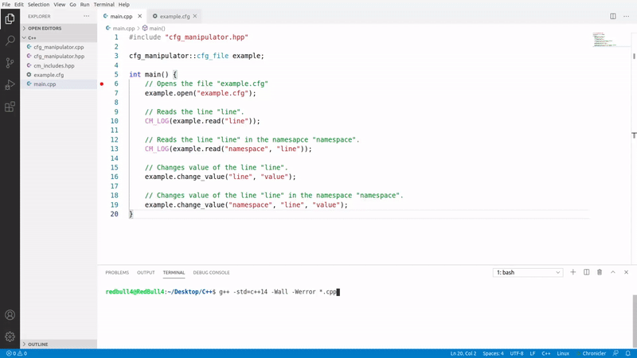

# cfg_manipulator [](https://travis-ci.com/RedBull4/cfg_manipulator)
* Copy ```cfg_manipulator.cpp```, ```cfg_manipulator.hpp``` and ```cm_includes.hpp``` to your project folder.
* GCC version: >= 6.
* For windows you need to download sed from this [this](https://github.com/mbuilov/sed-windows/raw/master/sed-4.8-x64.exe) link
  and make it executable from the command line by reading [this](https://stackoverflow.com/questions/4822400/register-an-exe-so-you-can-run-it-from-any-command-line-in-windows) post.
* Star this repo if you like it 😊.
## GIF
<p align="center">
  
</p>

## Compilation
* ```g++ -std=c++14 -Wall -Werror *.cpp```
## Code
``` cpp
// main.cpp

#include "cfg_manipulator.hpp"

cfg_manipulator::cfg_file example;

int main() {
    // Opens the file "example.cfg"
    example.open("example.cfg");

    // Reads the line "line".
    CM_LOG(example.read("line"));

    // Reads the line "line" in the namesapce "namespace".
    CM_LOG(example.read("namespace", "line"));

    // Changes value of the line "line".
    example.change_value("line", "value");

    // Changes value of the line "line" in the namespace "namespace".
    example.change_value("namespace", "line", "value");
}
```
```
# example.cfg

line = "value"

[namespace]
line = "value"
```
## License
[MIT](https://github.com/RedBull4/cfg_manipulator/blob/main/LICENSE)